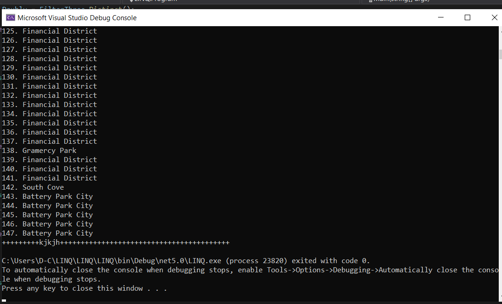

# Lab-9-LINQ

## Description:

 A program that brings in data from an external file, reads the data, and can filter the data based on specified values.

 ---

 ## Visuals

 

 ## Getting Started
Clone this repository to your local machine.

In a command line environment with Git installed:

[LINQ](https://github.com/yahia199/Lab-9-LINQ)

